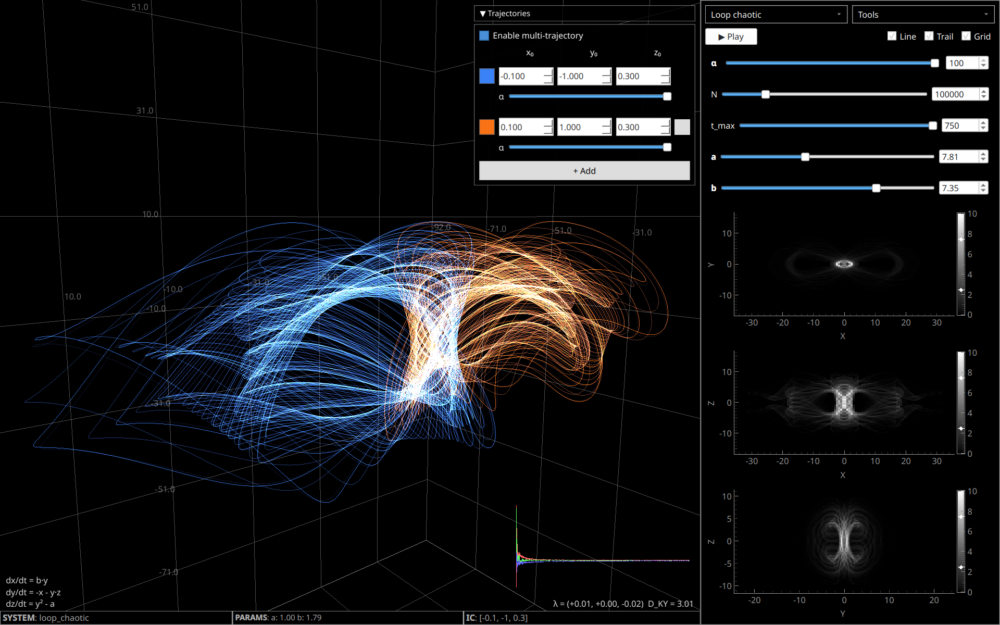
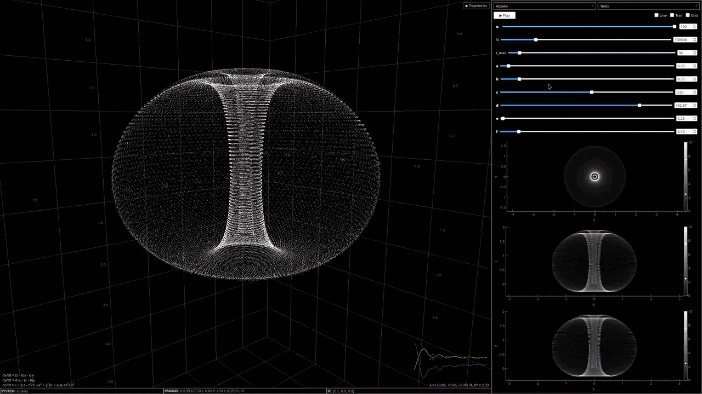
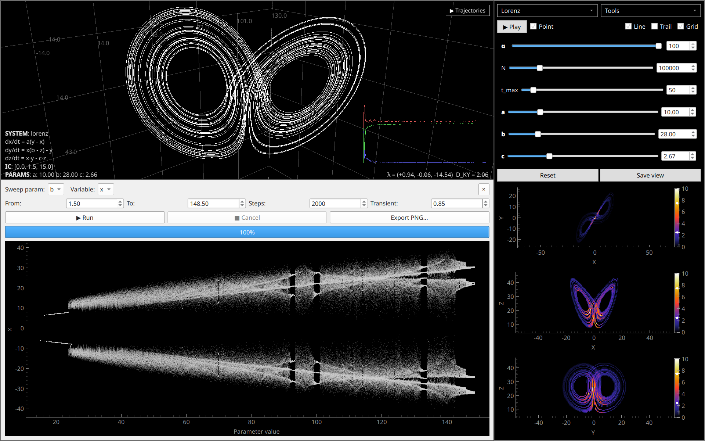
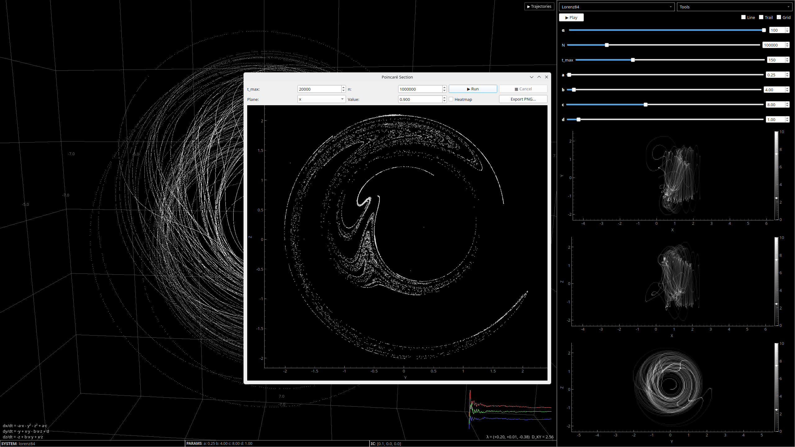

# strange-attractors-qt

PyQtGraph app for visualising strange attractors.

<table>
  <tr>
    <td></td>
    <td></td>
  </tr>
  <tr>
    <td></td>
    <td></td>
  </tr>
</table>

This is a local, more performant version of
[strange-attractor-visualiser](https://github.com/aymenhafeez/strange-attractor-visualiser)

## Current features

* Selection of attractors with real time slider updates for parameters
* Input custom attractor equations
* Trajectory animation
* Trail mode showing solution's time step evolution
* 2D heatmap projections
* Multi trajectory view with varying initial conditions
* Lyapunov exponent spectrum, convergence plots and Kaplan-Yorke dimension
* Bifuraction plot from Poincaré sweep
* Poincaré section view with configurable section plane
* Save and reload attractor configurations

## Running the app

```bash
git clone https://github.com/aymenhafeez/strange-attractors-qt
cd strange-attractors-qt
```

With uv:

```bash
uv sync
uv run strange-attractors
```

With pip:

```bash
pip install -e .
python -m attractors
```

Optionally use the `--fullscreen` flag to launch the app in fullscreen mode.

## Development

```bash
uv sync
uv run strange-attractors
```

Run tests:

```bash
uv run pytest -v
```

Enable performance logging (outputs attractor and lyapunov solve times):

```bash
ATTRACTOR_PROFILE=1 uv run strange-attractors
```

## TODO

* Extend expression parser to accept non strange attractor like systems
* Parametric system plotting
