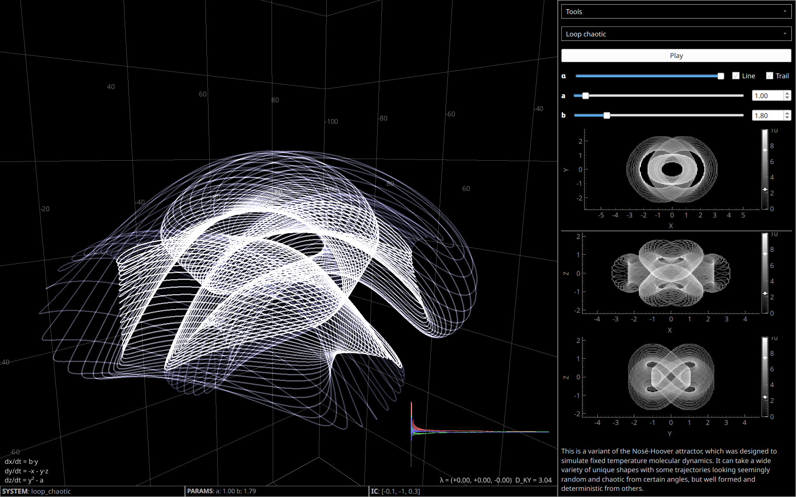

# strange-attractors-qt

PyQtGraph app for visualising strange attractors.

<table>
  <tr>
    <td></td>
    <td></td>
  </tr>
  <tr>
    <td></td>
    <td></td>
  </tr>
</table>

This is a local, more performant version of
[strange-attractor-visualiser](https://github.com/aymenhafeez/strange-attractor-visualiser)

## Running the app

```
git clone https://github.com/aymenhafeez/strange-attractors-qt
cd strange-attractors-qt
```

With uv:

```
uv sync
uv run strange-attractors
```

With pip:

```
pip install -e .
python -m src.attractors
```


Optionally use the `--fullscreen` flag to launch the app in fullscreen mode.
