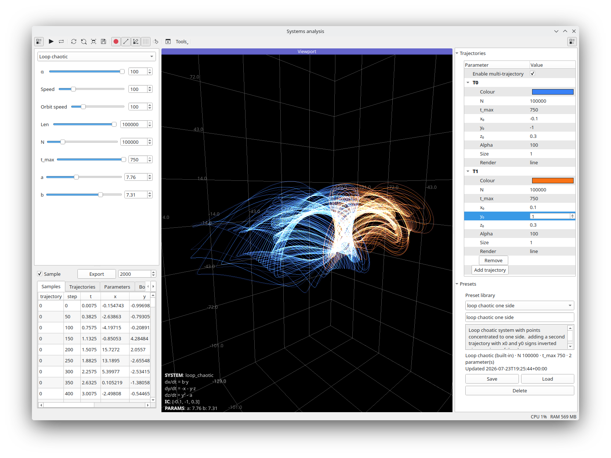
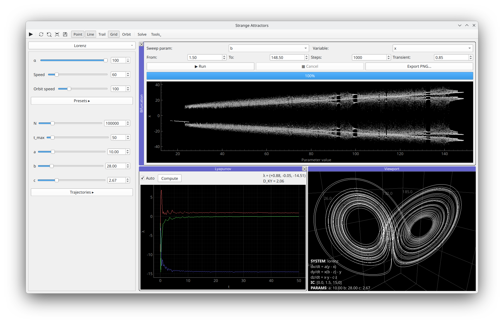
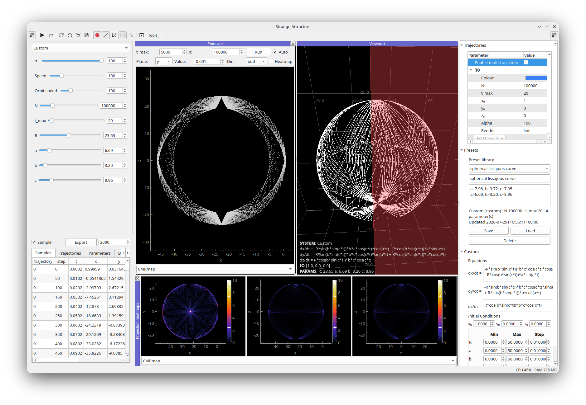
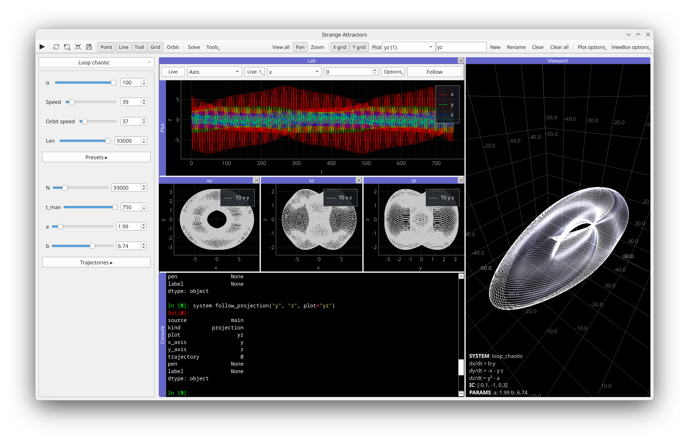

# strange-attractors-qt

[PyQtGraph](https://github.com/pyqtgraph/pyqtgraph) app for strange attractor and general mathematical visualisation and exploration.

<table>
  <tr>
    <td></td>
    <td></td>
  </tr>
  <tr>
    <td></td>
    <td></td>
  </tr>
</table>

## Features

The app currently consists of two areas: a three dimensional ODE system exploration area and a general scripting and visualisation area.

### Three dimensional ODE systems
While strange attractors are the main focus point here you can also input any 3D ODE system. The following analysis modes are available:
* 2D heatmap projections
* Multi trajectory view with varying initial conditions
* Lyapunov exponent spectrum, convergence plots and Kaplan-Yorke dimension
* Bifuraction diagrams
* Poincaré section view
* System property analysis from the integrated console

### Explore workspace

Consists of a QScintilla text editor connected to an embedded Jupyter console and plot widget. See the examples directory to get an idea of the plotting API.

## Installation

Requires [uv](https://docs.astral.sh/uv/getting-started/installation/)

```bash
git clone https://github.com/aymenhafeez/strange-attractors-qt
cd stange-attractors-qt
uv tool install .
analysis  # --fullscreen
```

## Development

```bash
git clone https://github.com/aymenhafeez/strange-attractors-qt
cd stange-attractors-qt
uv sync
uv run analysis
```

Run tests:

```bash
uv run pytest -q
```

Enable performance logging (outputs attractor and lyapunov solve times):

```bash
ANALYSIS_PROFILE=1 uv run analysis
```