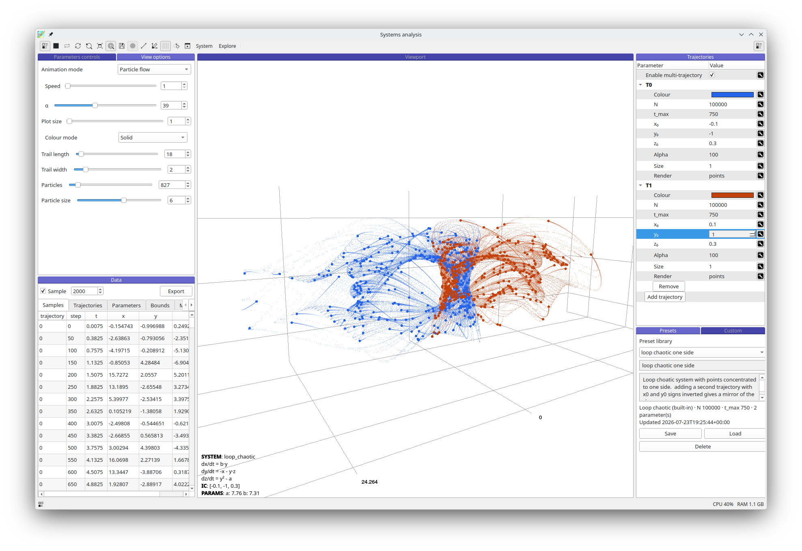
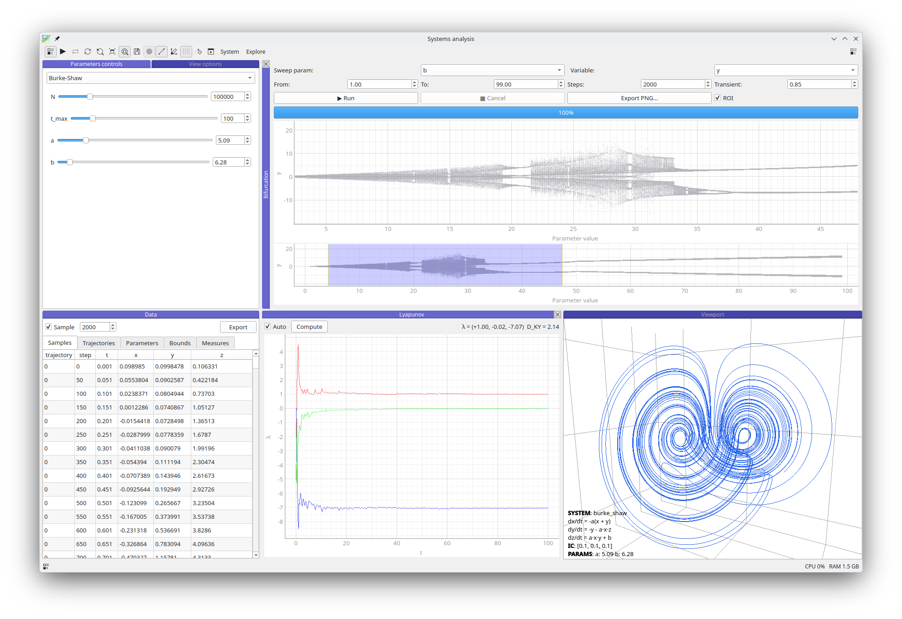
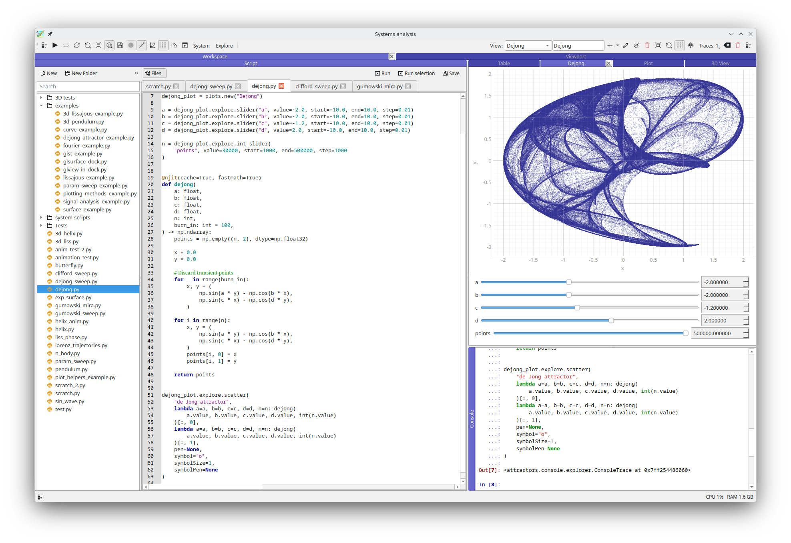
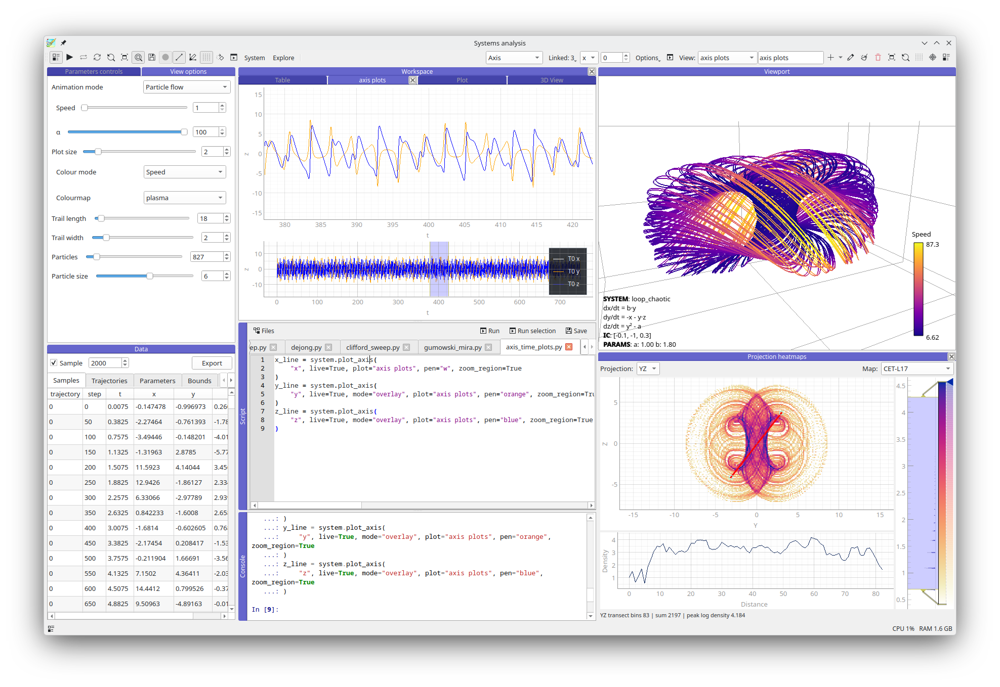

# strange-attractors-qt

Python tool for mathematical visualisation and exploration.

## Installation

Requires Python >=3.12 and
[uv](https://docs.astral.sh/uv/getting-started/installation/).

```bash
git clone https://github.com/aymenhafeez/strange-attractors-qt
cd strange-attractors-qt
uv tool install .
analysis  # --fullscreen
```

## Features

The app currently consists of two areas: a three dimensional ODE system exploration area and a general scripting and visualisation area.

### 3D ODE systems

While strange attractors are the main focus point here you can also input any 3D ODE system. The following analysis modes are available:

* 2D heatmap projections
* Multi trajectory view with varying initial conditions
* Lyapunov exponent spectrum, convergence plots and Kaplan-Yorke dimension
* Bifuraction diagrams
* Poincaré section view
* System property analysis from the integrated console

### Explore workspace

Consists of a QScintilla text editor connected to an embedded Jupyter console and plot
widget. For help with the plotting API run `system.help()` and `workspace.help()` in the
console, optionally with `table=True` to view the help in the workspace data viewer.
The file browser also has some example scripts to get started with.

### Screenshots

Every analysis panel is contained within a dock and so the layout of the panels can be
moved around to suit any given workflow.

<p>
  
  <br />
  <small>
    3D viewport area which contains the parameter controls, view options, data viewer,
    multi trajectory options and the custom system and preset panels. Screenshot taken
    with the particle flow animation playing which animates the point distribution along
    the trajectory.
  </small>
</p>

<p>
  
  <br />
  <small>
    Bifuraction and Lyapunov analysis modes
    in the 3D viewport area.
  </small>
</p>

<p>
  
  <br />
  <small>
    Explore workspace showing an interactive
    plot of the Peter de Jong attractor (see the examples directory for this script).
  </small>
</p>

<p>
  
  <br />
  <small>
    System workspace and projection heatmap analysis mode. The script and console panels
    are also connected to the systems in the 3D viewport area allowing for time against
    axis plots, trajectory separation comparison, system speed and displacement analysis
    and vector field quiver plots.
  </small>
</p>

If you run into any issues check the output panel (toggled from the bottom left or the
view menu option) and please file a bug report.

## Development

Open to PR's and feature requests. To work on the project:

```bash
git clone https://github.com/aymenhafeez/strange-attractors-qt
cd strange-attractors-qt
uv sync
uv run analysis
```

Testing and linting:

```bash
uv add --dev ruff pytest

uv run ruff check .
uv run pytest -q
```

Enable performance logging:

```bash
ANALYSIS_PROFILE=1 uv run analysis
```
